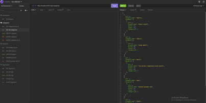
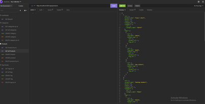
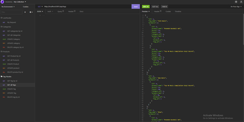

# Employee Management System
https://wingz003.github.io/E-commerce-de-Luigi/

# Description
This is the back end for an e-commerce site. This a homework assignment with a series of configurations with the use of rest api routes, SQL and sequelize.

[

# Table of Contents
* [Installation](#installation)
* [Usage](#usage)
* [Contributions](#contributions)
* [Questions](#questions)

## Installation
### You will need to install the following dependencies prior to running the application: 

Express, Mysql2, Express and Sequelize.

## Usage 
### Below are the following steps required to run this application: 

1. As soon as you input the command node node server.js, you will then be able to get on insomnia and be able to connect to the server and display configurations on insonmia.
 - Here is the display of all categories with associations.
 - You will be able to **GET**, **POST**, **PUT** AND **DELETE** on the categories route from here.

3. As stated above, you will be able to **GET**, **POST**, **PUT** AND **DELETE** on the products route from here with associations.

4. You will also be able to get your endpoints for your tags using the same http methods stated above!

## Contributions 

No contributions have been made.

## Questions
### If you have a questions or concerns, feel free to contact me at Lsanti618@gmail.com.
